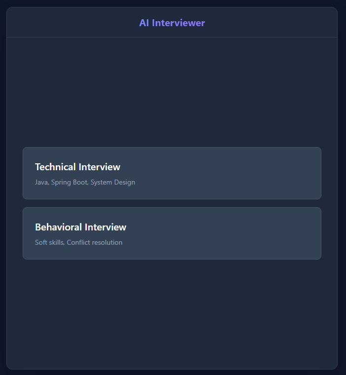
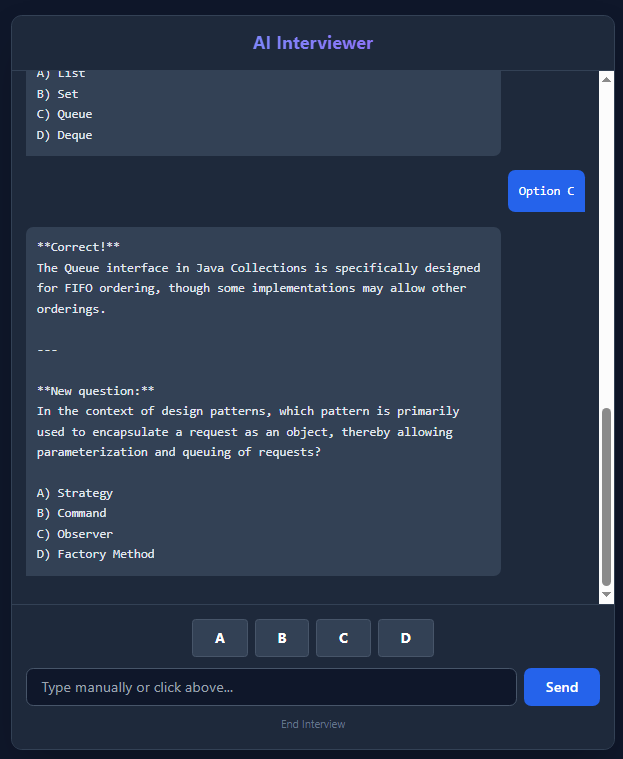
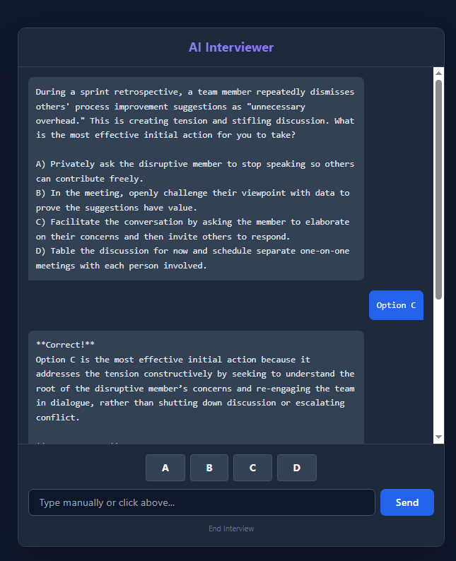

# 🤖 AI Technical Interviewer


A full-stack application that simulates a real job interview using the **DeepSeek API**. The backend generates context-aware **technical** and **behavioral** multiple-choice questions, evaluates the candidate's answers, gives short feedback, and immediately follows up with the next question — all in real time.

---

## 📸 Screenshots

### 1. Choose Your Path

Select between a **Technical Interview** (Java Collections, Design Patterns, Data Structures) or a **Behavioral Interview** (soft skills, conflict resolution, teamwork).



### 2. Deep Technical Questions

The AI challenges you with specific code scenarios, design patterns, and complexity questions.



### 3. Behavioral Situations

Practice your soft skills with situational judgement questions generated on the fly.



---

## 🚀 Key Features

- **🧠 LLM-powered evaluation** — DeepSeek's `deepseek-chat` model judges each answer (`Correct!` / `Incorrect.`), explains why in 1–2 sentences, then asks the next question.
- **🔄 Context-aware follow-ups** — the previous question is sent along with each answer so feedback stays on-topic.
- **🧩 Two interview tracks** — `TECHNICAL` (Java Collections, basic design patterns, data structures) and `BEHAVIORAL` (soft skills, conflict resolution, teamwork). A `SYSTEM_DESIGN` type is also declared in the enum and ready to be wired up.
- **🏗️ Strategy pattern** — `InterviewGenerationStrategy` with `TechnicalStrategy` and `BehavioralStrategy` implementations make it straightforward to plug in new interview types.
- **🗄️ Persistent sessions** — each interview is stored in PostgreSQL with an id, type, status (`PENDING` / `IN_PROGRESS` / `COMPLETED`), title, and creation timestamp.
- **🎨 Modern UI** — clean dark-mode interface built with React 19, Vite, and Tailwind CSS.
- **⚡ No local LLM needed** — the app calls DeepSeek's cloud API directly; no GPU or local model required.

---

## 🛠️ Tech Stack

### Backend (`ai-interviewer/`)

- **Java 21**
- **Spring Boot 4.0** — `spring-boot-starter-webmvc`, `spring-boot-starter-data-jpa`, `spring-boot-starter-security`
- **Spring `RestClient`** for calling the DeepSeek API
- **PostgreSQL** via Spring Data JPA
- **Lombok** (annotation processor)
- **Maven Wrapper** (`./mvnw`)

### Frontend (`ai-interviewer-front/`)

- **React 19** + **Vite 7**
- **Tailwind CSS 3** (with PostCSS + autoprefixer)
- **ESLint 9**

### AI Engine

- **DeepSeek API** — `https://api.deepseek.com/chat/completions`, model `deepseek-chat`

---

## 📁 Project Structure

```
ProjetChatBotAi/
├── ai-interviewer/                # Spring Boot backend
│   ├── src/main/java/com/portfolio/ai_interviewer/
│   │   ├── AiInterviewerApplication.java
│   │   ├── config/SecurityConfig.java
│   │   ├── controller/InterviewController.java
│   │   ├── dto/                   # DeepSeekRequest/Response, InterviewStart/ChatRequest
│   │   ├── model/                 # Interview entity + InterviewType / InterviewStatus enums
│   │   ├── repository/InterviewRepository.java
│   │   └── service/
│   │       ├── InterviewService.java
│   │       └── strategy/          # InterviewGenerationStrategy + Technical/Behavioral impls
│   ├── compose.yaml               # PostgreSQL service for local dev
│   └── pom.xml
│
└── ai-interviewer-front/          # React + Vite frontend
    ├── src/
    │   ├── App.jsx
    │   ├── components/
    │   │   ├── WelcomeScreen.jsx
    │   │   └── ChatInterface.jsx
    │   └── main.jsx
    ├── tailwind.config.js
    ├── vite.config.js
    └── package.json
```

---

## ⚙️ Getting Started

### Prerequisites

- **Java JDK 21**
- **Node.js 18+** and npm
- **PostgreSQL** running locally (or Docker, see below)
- A **DeepSeek API key** — get one at [platform.deepseek.com](https://platform.deepseek.com/)

### 1. Clone the repo

```bash
git clone https://github.com/<your-user>/ProjetChatBotAi.git
cd ProjetChatBotAi
```

### 2. Start PostgreSQL

The easiest option is the bundled Docker Compose file:

```bash
cd ai-interviewer
docker compose up -d
```

This starts PostgreSQL with:

- database: `mydatabase`
- user: `myuser`
- password: `secret`
- port: `5432` (mapped to a random host port by default — adjust `compose.yaml` if you want a fixed `5432:5432` mapping)

Or run your own Postgres instance and adjust the connection settings in step 3.

### 3. Configure the backend

Create `ai-interviewer/src/main/resources/application.properties` (it isn't committed) with at least:

```properties
# DeepSeek
deepseek.api.key=sk-YOUR_API_KEY_HERE

# Database
spring.datasource.url=jdbc:postgresql://localhost:5432/mydatabase
spring.datasource.username=myuser
spring.datasource.password=secret

# JPA
spring.jpa.hibernate.ddl-auto=update
spring.jpa.show-sql=true

# Server
server.port=8080
```

> ⚠️ Never commit your real API key. `application.properties` is already in `.gitignore`.

### 4. Run the backend

From `ai-interviewer/`:

```bash
./mvnw spring-boot:run          # macOS / Linux
mvnw.cmd spring-boot:run        # Windows
```

The API will be live at **http://localhost:8080**.

### 5. Run the frontend

From `ai-interviewer-front/`:

```bash
npm install
npm run dev
```

Open **http://localhost:5173** in your browser. The backend's CORS config already whitelists this origin.

---

## 🔌 API Reference

All endpoints are exposed under `/api/interviews` and accept/return JSON.

### `POST /api/interviews/start`

Creates a new interview session and returns the first question.

**Request body:**

```json
{
  "title": "Junior Java Dev",
  "type": "TECHNICAL"
}
```

`type` must be one of `TECHNICAL`, `BEHAVIORAL`, `SYSTEM_DESIGN`.

**Response:**

```json
{
  "interviewId": 1,
  "firstQuestion": "Which of the following best describes the difference between HashMap and TreeMap? A) ... B) ... C) ... D) ..."
}
```

### `POST /api/interviews/chat`

Submits the candidate's answer to the previous question and gets feedback + the next question.

**Request body:**

```json
{
  "interviewId": 1,
  "userMessage": "B",
  "context": "Which of the following best describes the difference between HashMap and TreeMap? A) ... B) ... C) ... D) ..."
}
```

**Response:**

```json
{
  "response": "Correct! TreeMap maintains keys in sorted order while HashMap does not. Next question: ..."
}
```

A ready-to-run `ai-interviewer/src/api-test.http` file is included for IntelliJ / VS Code REST Client.

---

## 🧱 Architecture Notes

- **Strategy Pattern** — `InterviewGenerationStrategy` defines `generateFirstQuestion()` and `supports(type)`. `TechnicalStrategy` and `BehavioralStrategy` implement it. New interview types only need a new strategy class — no changes to the controller.
- **DeepSeek client** — a single `RestClient` bean in `InterviewService` calls `POST /chat/completions` with a `DeepSeekRequest` DTO and parses a `DeepSeekResponse` DTO. The API key is injected from `application.properties` via `@Value("${deepseek.api.key}")`.
- **Security** — `SecurityConfig` currently disables CSRF and permits all requests. This is intentional for local development; **harden this before deploying anywhere public** (add authentication, re-enable CSRF for state-changing endpoints, and configure CORS with `cors()` instead of disabling it).
- **CORS** — the controller has `@CrossOrigin(origins = "http://localhost:5173")` to allow the Vite dev server during development.

---

## 🗺️ Roadmap / Ideas

- Wire up `SYSTEM_DESIGN` interviews (enum exists, strategy class does not yet)
- Persist the conversation history per interview (currently only the last question is sent back as context)
- Mark interviews as `COMPLETED` after N questions and show a final summary / score
- Add authentication and per-user interview history
- Replace `cors.disable()` with a real CORS configuration